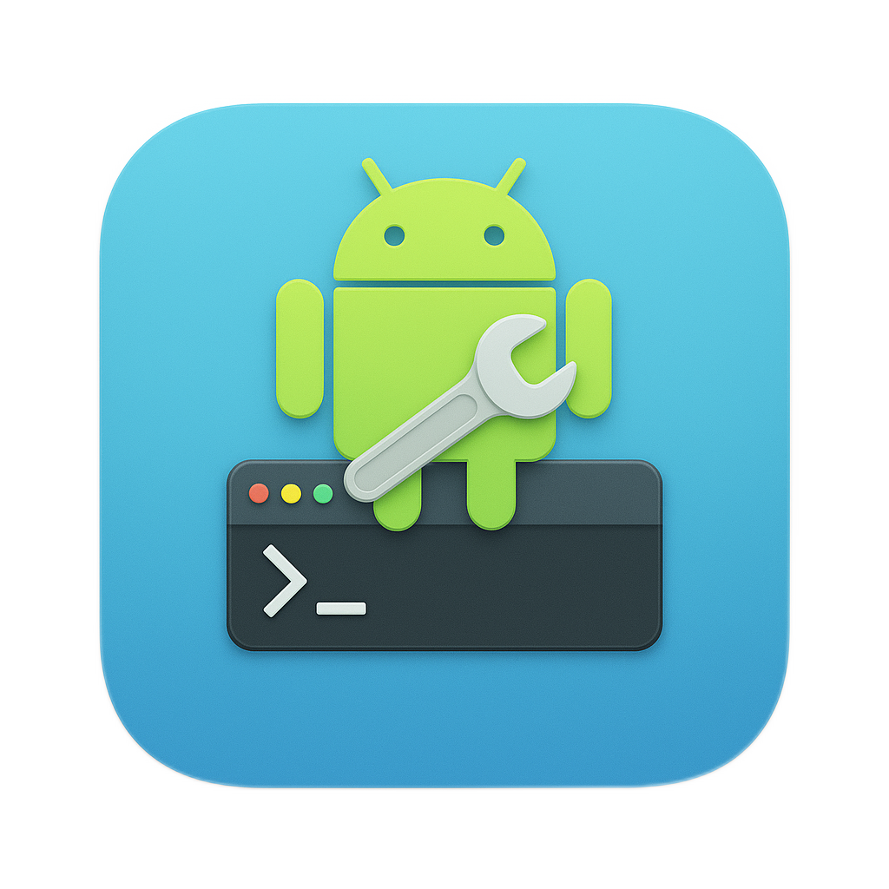

# DroidKit 📱

**DroidKit** is a comprehensive macOS desktop application for Android developers that provides essential ADB (Android Debug Bridge) tools through an intuitive graphical interface.



## ✨ Features

### 📟 Device Management
- **Auto-discovery** of connected Android devices and emulators
- **Real-time status monitoring** with connection indicators
- **Multiple device support** with easy switching
- **Device information display** (model, Android version, API level, serial)

### 🚀 AVD (Android Virtual Device) Management
- **List available AVDs** from your Android SDK
- **Launch emulators** directly from the app
- **Quick access** AVD controls in sidebar
- **Automatic device detection** after AVD launch

### ⚙️ Configuration & Settings
- **Automatic ANDROID_HOME detection** from environment variables
- **Common SDK path discovery** (macOS standard locations)
- **SDK path configuration** with validation
- **Persistent settings** storage

### 📁 File Explorer
- **Browse device filesystem** with intuitive navigation
- **File and folder management** with permissions display
- **Download files** from device to local machine
- **Path navigation** with breadcrumbs and history
- **File size and permission details**

### 📋 App Management
- **List all installed applications** (system and user)
- **Search and filter** applications by name
- **Distinguish system vs user apps** with badges
- **Package name and app info display**
- **Future: Install/uninstall APKs**

### 📊 Logcat Viewer
- **Real-time log monitoring** with configurable line count
- **Log level filtering** with color-coded output
- **Search and filter** logs by keywords
- **Export logs** to text files
- **Terminal-style display** with syntax highlighting

## 🛠️ Tech Stack

- **Frontend**: React 19 + TypeScript + Tailwind CSS
- **UI Components**: Shadcn UI component library
- **Backend**: Tauri 2.0 + Rust
- **ADB Integration**: `adb_client` Rust crate
- **Build Tool**: Bun for fast package management
- **Platform**: macOS (with potential for cross-platform expansion)

## 🚀 Getting Started

### Prerequisites

1. **Node.js & Bun**: Install Bun for package management
   ```bash
   curl -fsSL https://bun.sh/install | bash
   ```

2. **Rust**: Required for Tauri backend
   ```bash
   curl --proto '=https' --tlsv1.2 -sSf https://sh.rustup.rs | sh
   ```

3. **Android SDK**: Install Android Studio or standalone SDK
   - Set `ANDROID_HOME` environment variable
   - Ensure `adb` is in your PATH

### Installation

1. **Clone the repository**
   ```bash
   git clone <repository-url>
   cd droidkit
   ```

2. **Install dependencies**
   ```bash
   bun install
   ```

3. **Run in development mode**
   ```bash
   bun run tauri dev
   ```

4. **Build for production**
   ```bash
   bun run tauri build
   ```

## 📖 Usage

### Connecting Devices

1. **USB Devices**: Enable USB debugging on your Android device and connect via USB
2. **Emulators**: Launch AVDs directly from DroidKit or use Android Studio
3. **Network Devices**: Future feature for wireless ADB connections

### File Management

- Navigate using folder icons or path breadcrumbs
- Click files to view details, folders to navigate
- Use the download button to save files to your Desktop
- Use back/home buttons for quick navigation

### Log Monitoring

- Adjust line count for log buffer size
- Use search to filter logs by keywords
- Export logs for debugging or sharing
- Color-coded log levels (Verbose, Debug, Info, Warning, Error, Fatal)

### App Management

- Search installed apps by name or package
- View system vs user applications
- Future: Install APKs, view app details, manage permissions

## 🏗️ Project Structure

```
droidkit/
├── src/                          # React frontend
│   ├── components/               # UI components
│   │   ├── ui/                   # Shadcn UI base components
│   │   ├── Header.tsx            # App header with branding
│   │   ├── Sidebar.tsx           # Device list and AVD controls
│   │   ├── MainContent.tsx       # Tabbed main interface
│   │   ├── FileExplorer.tsx      # File browser component
│   │   ├── AppManager.tsx        # App management interface
│   │   ├── LogcatViewer.tsx      # Log monitoring component
│   │   └── SettingsDialog.tsx    # Configuration modal
│   ├── lib/                      # Utilities
│   └── App.tsx                   # Main application
├── src-tauri/                    # Tauri backend
│   ├── src/
│   │   ├── adb_commands.rs       # ADB operations
│   │   ├── lib.rs                # Tauri commands
│   │   └── main.rs               # Application entry
│   ├── Cargo.toml                # Rust dependencies
│   └── tauri.conf.json           # Tauri configuration
├── public/                       # Static assets
└── README.md                     # Documentation
```

## 🔧 Available Commands

### Frontend Commands
- `bun run dev` - Start Vite development server
- `bun run build` - Build for production
- `bun run preview` - Preview production build

### Tauri Commands
- `bun run tauri dev` - Run app in development mode
- `bun run tauri build` - Build production app
- `bun run tauri info` - Show environment info

## 🎯 Roadmap

### Phase 1 ✅ (Completed)
- [x] Basic device detection and information
- [x] File browser with download capability
- [x] App listing and management
- [x] Logcat viewer with filtering
- [x] AVD management and launching
- [x] Settings and configuration

### Phase 2 🚧 (Future)
- [ ] Real-time logcat streaming
- [ ] APK installation and app uninstalling
- [ ] Screenshot capture and screen recording
- [ ] Network ADB connections
- [ ] Performance monitoring (CPU, memory, battery)
- [ ] Interactive ADB shell terminal

### Phase 3 🔮 (Vision)
- [ ] Plugin system for custom tools
- [ ] Multi-device operations
- [ ] Automated testing integration
- [ ] Device farm management
- [ ] Cloud device support

## 🤝 Contributing

1. Fork the repository
2. Create your feature branch (`git checkout -b feature/amazing-feature`)
3. Commit your changes (`git commit -m 'Add amazing feature'`)
4. Push to the branch (`git push origin feature/amazing-feature`)
5. Open a Pull Request

## 📄 License

This project is licensed under the MIT License - see the LICENSE file for details.

## 🙏 Acknowledgments

- **Tauri** - For the excellent Rust-based app framework
- **Shadcn UI** - For beautiful, accessible UI components
- **adb_client** - For Rust ADB integration
- **Lucide** - For consistent iconography
- **Android Open Source Project** - For ADB and development tools

## 📞 Support

If you encounter any issues or have questions:
1. Check the [Issues](../../issues) page for existing solutions
2. Create a new issue with detailed information
3. Join our community discussions

---

**Built with ❤️ for the Android developer community**